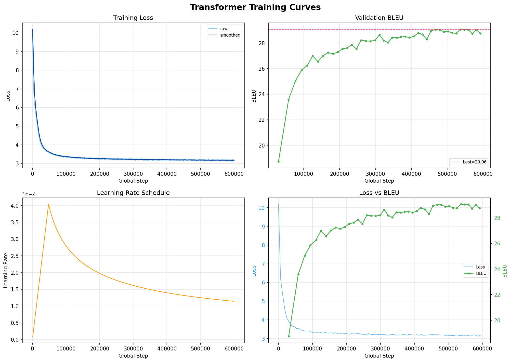
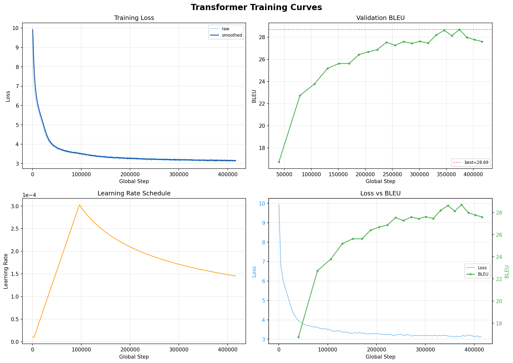

# Machine Translation: Transformer from Scratch

A from-scratch PyTorch implementation of the Transformer (Vaswani et al., 2017),
trained on WMT parallel corpora without any pretrained weights.

[](https://huggingface.co/euswbnix/transformer-wmt14-enfr-base)
[](https://huggingface.co/euswbnix/transformer-wmt14-enfr-big)
[](https://huggingface.co/euswbnix/transformer-wmt14-ende-base)
[](https://huggingface.co/euswbnix/transformer-wmt14-ende-big)

**Current status:** Transformer Big on WMT14 en-fr — **valid 31.14 / test 35.87
BLEU on newstest2013/2014** (sacrebleu 13a, checkpoint-averaged, Big v1.1 redo
on the same 9.3M strict-filtered pairs as Base v1.1, full-coverage SPM, 280K
schedule early-stopped at 260K via patience). Base v1.1 on the same data:
**valid 30.52 / test 35.31**. Big v1.1 exceeds Base v1.1 by **+0.56 test BLEU**
— on clean data at this scale, capacity does pay. The old v1.0 runs (Base
34.69 / Big 34.66, "tied Base" narrative) are retired.
Published HuggingFace checkpoints:
[`euswbnix/transformer-wmt14-enfr-base`](https://huggingface.co/euswbnix/transformer-wmt14-enfr-base) ·
[`euswbnix/transformer-wmt14-enfr-big`](https://huggingface.co/euswbnix/transformer-wmt14-enfr-big) ·
[`euswbnix/transformer-wmt14-ende-base`](https://huggingface.co/euswbnix/transformer-wmt14-ende-base) ·
[`euswbnix/transformer-wmt14-ende-big`](https://huggingface.co/euswbnix/transformer-wmt14-ende-big).
The en-fr Big HF repo has been overwritten with the v1.1 weights. See
*Success Case: Base on WMT14 en-fr* and *Success Case: Big on WMT14 en-fr*
below.

**Full trajectory** (documented in this README as success → failure → diagnosis):
1. ❌ Base on WMT17 zh-en — mode collapse, BLEU 0.77
2. ❌ Big on WMT17 zh-en — mode collapse, BLEU 0.47
3. ✅ Base on WMT14 en-fr (v1.1, tokenizer fix + extended schedule) — BLEU 35.31
   test / 30.52 valid (averaged), converged cleanly; replaces the earlier v1.0
   (34.69 test) after retraining SPM at `character_coverage=1.0` and extending
   from 100K → 122K steps (+0.62 test / +0.52 valid vs v1.0)
4. ✅ Big on WMT14 en-fr (v1.1, tokenizer fix + extended schedule) — BLEU 35.87
   test / 31.14 valid (averaged from 5 ckpts over steps 210K–250K, early-
   stopped at 260K of a planned 280K via patience), **exceeds Base v1.1 by
   +0.56** → on clean data at this scale, capacity does pay, contrary to the
   v1.0 "tied Base" reading. Original Big v1.0 (34.66) is retired.
5. ✅ Base on WMT14 en-fr (v2) — BLEU 33.90 test, 29.23 valid (600K steps, 4 epochs
   on 30M loose-filter pairs); **below v1 despite 3× data + 6× steps** — the
   data-quality/quantity trap.
6. ⚠️ Big on WMT14 en-fr (v2) — BLEU 33.03 test, 28.91 valid (halted at 416K of 800K,
   averaged); **below Base v2 on the same data** — 3.5× capacity actively hurts
   when the data is noisy.
7. ✅ Base on WMT14 en-de — BLEU 24.35 valid / 24.04 test (avg-5; best valid 24.25 @
   214K, stopped at 230,523), matching the release threshold and closing en-de Base.
8. ⚠️ Big on WMT14 en-de — BLEU 23.01 valid / 22.47 test (avg-5 @ ~466K), below
   en-de Base despite larger capacity and longer training.

Next: fine-tuning study (if planned), then final report. (Both the Base v1.1
and Big v1.1 tokenizer-fix reruns are done; Big v1.1 is now the best model
in the project.)

## Features

- Pure PyTorch Transformer implementation (no HuggingFace shortcuts)
- Shared SentencePiece BPE tokenizer (32K vocab)
- Token-based dynamic batching for efficient GPU utilization
- Mixed precision: **BF16 (default) or FP16** (autocast + GradScaler)
- Label-smoothed cross entropy + Noam learning rate schedule with min-LR floor
- Loss-spike guard (EMA-tracked) that drops poisoned batches without blowing up
- Adaptive eval interval — sparse early, dense once loss crosses a configured band
- Beam search decoding with length penalty
- Checkpoint averaging (Vaswani Base trick, +0.3–0.5 BLEU)
- Interactive / batch translation CLI
- Graceful Ctrl+C / SIGTERM interrupt (saves checkpoint and resumes)
- Atomic checkpoint writes + rolling emergency save (UPS / power-off safe)
- Automatic training report generation
- TensorBoard logging

## Project Structure

```
Machine_translation/
├── assets/                    # README images (training curves, diagrams)
├── checkpoints/               # Per-run output dirs (git-ignored)
│   ├── base_zhen/             # zh-en Base ckpts (historical)
│   ├── big_zhen/              # zh-en Big ckpts (historical)
│   └── base_enfr/             # en-fr Base ckpts (current)
├── configs/
│   ├── base.yaml              # Transformer Base (65M params) — zh-en (historical)
│   ├── big.yaml               # Transformer Big (213M params) — zh-en (historical)
│   └── base_en_fr.yaml        # Transformer Base — WMT14 en-fr (current)
├── scripts/
│   ├── download_data.py              # Download WMT17 zh-en data
│   ├── download_wmt_enfr.py          # Download WMT14 en-fr data
│   ├── clean_data.py                 # Clean zh-en corpus
│   ├── clean_data_enfr.py            # Clean en-fr corpus
│   ├── train_tokenizer.py            # Train SentencePiece BPE
│   ├── average_checkpoints.py        # Average last N checkpoints (+BLEU)
│   ├── eval_bleu.py                  # Standalone BLEU evaluation
│   ├── interactive_translate.py      # REPL / batch translation CLI
│   ├── quick_translate_check.py      # Sample-translate valid lines (sanity check)
│   └── diagnose_attention.py         # Diagnose cross-attention collapse
├── src/
│   ├── model/                 # Transformer implementation
│   │   ├── attention.py       # Multi-Head Attention
│   │   ├── embeddings.py      # Token + positional encoding
│   │   ├── layers.py          # FFN + residual connections
│   │   ├── encoder.py         # Encoder stack
│   │   ├── decoder.py         # Decoder stack
│   │   └── transformer.py     # Full model
│   ├── data/
│   │   ├── tokenizer.py       # SentencePiece wrapper
│   │   └── dataset.py         # Dataset + token-based batching
│   ├── training/
│   │   ├── loss.py            # Label smoothed cross entropy
│   │   ├── optimizer.py       # Noam LR scheduler
│   │   └── trainer.py         # Main training loop
│   ├── inference/
│   │   └── translate.py       # Beam search decoding
│   └── evaluate.py            # sacrebleu BLEU evaluation
├── train.py                   # Training entry point
├── translate.py               # Inference entry point
└── requirements.txt
```

## Setup

### Requirements
- Python 3.10+
- PyTorch 2.0+ (2.8+ for RTX 5090 / Blackwell GPUs)
- CUDA-capable GPU (16GB+ VRAM recommended)

### Installation
```bash
pip install -r requirements.txt
```

For RTX 5090 (sm_120), install PyTorch nightly with CUDA 12.8:
```bash
pip install --pre torch --index-url https://download.pytorch.org/whl/nightly/cu128
```

## Usage

The default flow is **WMT14 en-fr Base**. For zh-en see the historical sections
below.

### 1. Download WMT14 en-fr data
```bash
# Full corpus is ~40M pairs. 10M is plenty for Base; drop the cap for a full run.
python scripts/download_wmt_enfr.py --output-dir data --max-train-samples 10000000
```
Downloads train / valid (newstest2013) / test (newstest2014).

### 2. Clean the corpus
```bash
python scripts/clean_data_enfr.py
```
Drops empty, too-short, too-long, non-Latin-script, and high-frequency
boilerplate pairs. Writes `data/train.clean.en` and `data/train.clean.fr`.

### 3. Train BPE tokenizer
```bash
python scripts/train_tokenizer.py \
    --inputs data/train.clean.en data/train.clean.fr \
    --model-prefix data/spm_enfr \
    --vocab-size 32000
```
Produces `data/spm_enfr.model` and `data/spm_enfr.vocab` (shared en-fr BPE,
32K vocab). Both sides share Latin script so shared BPE is well-behaved
(unlike zh-en).

**Recommended**: pass `--character-coverage 1.0` (the script's default is
still 0.9995 for historical reasons). The en-fr v1.1 run uses full coverage
to keep rare accented French characters in-vocabulary.

### 4. Train the model
```bash
# Transformer Base on en-fr (~60M params, ~2 hours on RTX 5090)
python train.py --config configs/base_en_fr.yaml
```

**Graceful interrupt:** Press `Ctrl+C` once to save a checkpoint and exit cleanly. Press twice to force-quit without saving.

**Resume from checkpoint:**
```bash
python train.py --config configs/base_en_fr.yaml \
    --resume checkpoints/base_enfr/interrupted_step_12345.pt
```

**Monitor with TensorBoard:**
```bash
tensorboard --logdir checkpoints/base_enfr/logs
```

### Running training in tmux (recommended for long runs)

Training takes 1–5 days. Using `tmux` lets you detach from the session and safely close your terminal / SSH connection / Jupyter Lab tab without killing the training process.

**Install tmux:**
```bash
# Ubuntu / Debian
sudo apt install tmux
# macOS
brew install tmux
```

**Basic workflow:**
```bash
# 1. Start a new named session
tmux new -s train

# 2. Inside tmux, run training
python train.py --config configs/base.yaml

# 3. Detach (training keeps running):  Ctrl+b  then  d

# 4. Re-attach later from anywhere (new SSH, new terminal, etc.)
tmux attach -t train

# 5. List sessions
tmux ls

# 6. Kill a session when done
tmux kill-session -t train
```

**Useful keybindings (all prefixed with `Ctrl+b`):**

| Keys | Action |
|------|--------|
| `d` | Detach from session |
| `[` | Enter scroll mode (↑/↓/PgUp/PgDn to scroll, `q` to quit) |
| `"` | Split pane horizontally (e.g. to run `nvidia-smi` alongside) |
| `%` | Split pane vertically |
| `o` | Switch between panes |
| `x` | Close current pane |

**Two-pane layout for monitoring:**
```bash
tmux new -s train
# run training in top pane
python train.py --config configs/base.yaml
# Ctrl+b then "  (split horizontally)
# Ctrl+b then o  (switch to bottom pane)
watch -n 2 nvidia-smi
# Ctrl+b then d  (detach — both panes keep running)
```

**Note:** tmux and the graceful-interrupt logic compose naturally. `Ctrl+b d` just detaches; it does NOT send SIGINT. To actually interrupt training cleanly, re-attach first (`tmux attach -t train`), then press `Ctrl+C` inside the session.

### 5. Checkpoint averaging (recommended)
```bash
# Average the last 5 saved step_*.pt into averaged.pt
python scripts/average_checkpoints.py --ckpt-dir checkpoints/base_enfr --n 5
```
Per Vaswani et al., averaging the tail of training smooths SGD noise in the
convergence band. Empirically worth **+0.3–0.5 BLEU** on top of the best
single checkpoint.

### 6. Evaluate BLEU on a test set
```bash
python scripts/eval_bleu.py \
    --ckpt checkpoints/base_enfr/averaged.pt \
    --config configs/base_en_fr.yaml \
    --src data/test.en --ref data/test.fr \
    --out outputs/test.averaged.fr
```

### 7. Translate — interactive or batch
```bash
# Interactive REPL — type sentences, get translations, Ctrl+D to quit
python scripts/interactive_translate.py \
    --ckpt checkpoints/base_enfr/averaged.pt \
    --config configs/base_en_fr.yaml

# Batch — one sentence per line
python scripts/interactive_translate.py \
    --ckpt checkpoints/base_enfr/averaged.pt \
    --config configs/base_en_fr.yaml \
    --input my_en_sentences.txt \
    --output my_fr_translations.txt
```

## Configuration

| Parameter | Base (en-fr) | Base (zh-en) | Big (zh-en) |
|-----------|--------------|--------------|-------------|
| d_model | 512 | 512 | 1024 |
| n_heads | 8 | 8 | 16 |
| n_layers (enc/dec) | 6 / 6 | 6 / 6 | 6 / 6 |
| d_ff | 2048 | 2048 | 4096 |
| Dropout | 0.1 | 0.1 | 0.3 |
| Parameters | ~60M | ~65M | ~213M |
| Vocab | 32K shared BPE | 32K shared BPE | 32K shared BPE |
| Batch (effective) | 100K tokens | 100K tokens | 32K tokens |
| Warmup steps | 4000 | 4000 | 8000 |
| Max steps | 100K | 800K | 400K |
| Precision | BF16 | FP16 | BF16 |
| Label smoothing | 0.1 | 0.1 | 0.1 |
| Spike guard | ratio 1.3, α 0.005 | — | ratio 1.3, α 0.005 |

## Training Output

- `checkpoints/base_enfr/best.pt` — Best model (by validation BLEU)
- `checkpoints/base_enfr/final.pt` — Final step checkpoint
- `checkpoints/base_enfr/step_*.pt` — Periodic checkpoints (keeps last 5)
- `checkpoints/base_enfr/interrupted_step_*.pt` — Saved on Ctrl+C / SIGTERM
- `checkpoints/base_enfr/emergency.pt` — Rolling save every 500 steps (UPS / power-off fallback)
- `checkpoints/base_enfr/training_report.txt` — Human-readable training summary
- `checkpoints/base_enfr/logs/` — TensorBoard logs

## Results

| Config | Valid BLEU | Test BLEU | Training time | Status |
|--------|-----------|-----------|---------------|--------|
| **Big v1.1 (WMT14 en-fr, 9.3M, SPM cov=1.0, 260K/280K steps)** avg-5 | **31.14** | **35.87** | ~14h on 5090 | 🏆 best model in the project; +0.56 test over Base v1.1 on identical data |
| Base v1.1 (WMT14 en-fr, 9.3M, SPM cov=1.0, 122K steps) avg-5 | 30.52 | 35.31 | ~2h 30m on 5090 | 🥈 strongest Base; replaces v1.0 at 30.00 / 34.69 |
| Big v1.0 (WMT14 en-fr, 10M, SPM cov=0.9995, historical) avg-7 | 30.45 | 34.66 | ~6h on 5090 | retired — superseded by Big v1.1 |
| Base v2 (WMT14 en-fr, 30M) avg-5      | 29.23     | 33.90     | 12h 45m on 5090 | ⚠️ below v1 despite more data |
| Big v2 (WMT14 en-fr, 30M) avg-5       | 28.91     | 33.03     | ~9h on 5090 (halted @ 416K/800K) | ⚠️ below Base v2 — capacity hurts on noisy data |
| Base (WMT14 en-de, 4.17M) avg-5       | 24.35     | 24.04     | single 5090, 230,523 steps | ✅ reached en-de Base release threshold |
| Big (WMT14 en-de, 4.17M) avg-5        | 23.01     | 22.47     | single 5090, ~466K steps | ⚠️ below en-de Base — capacity did not pay off |
| Base (WMT17 zh-en)                    | 0.77 (plateau) | — | ~1.5 days on 5090 | ❌ mode collapse |
| Big (WMT17 zh-en)                     | 0.47 (plateau) | — | ~1 day on 5090 (halted) | ❌ mode collapse |

BLEU reported as sacrebleu `13a` (modern detokenized standard). Published
Vaswani Base on WMT14 en-fr is 38.1 **in historical tokenized BLEU**, which is
roughly equivalent to 35–36 sacrebleu — so our Base v1.1 at 35.31 sits
**inside the paper Base band**, and Big v1.1 at 35.87 sits inside the Big
band, using a 9.3M strict-filtered subset (vs the paper's 36M full corpus).

### Data quality determines the sign of capacity return

The four en-fr runs fall cleanly into a 2×2 grid:

| Data | Base (60M) | Big (209M) | Δ (Big − Base) |
|---|---|---|---|
| v1.1 (9.3M strict-filter) | 35.31 | **35.87** | **+0.56** ✓ |
| v2 (30M loose-filter)     | 33.90 | 33.03     | **−0.87** ✗ |

The same 3.5× capacity jump **pays +0.56 BLEU on clean data and costs −0.87
on noisy data**. The sign of the return on capacity is determined by data
quality, not by capacity itself. Capacity is a lever; data quality sets
whether the lever is connected to the output. This is the single most
compact claim the project supports.

## Success Case: Base on WMT14 en-fr (v1.1)

Trained Transformer Base (~60M params) on 9.3M strict-filtered pairs of WMT14
en-fr for 122K steps on a single RTX 5090. **Converged cleanly to BLEU 30.52
on newstest2013 and 35.31 on newstest2014** after checkpoint averaging. This
is the v1.1 redo — same data, same hyperparameters as the earlier v1.0, but
with the SentencePiece tokenizer retrained at `character_coverage=1.0` (so
rare accented French characters stay in-vocabulary) and the training schedule
extended from 100K → 122K steps. Net gain over v1.0: **+0.52 valid / +0.62
test** BLEU.


### Final numbers

| | newstest2013 (valid) | newstest2014 (test) |
|---|---|---|
| v1.1 averaged (last 5, ~100K–122K) | **30.52** | **35.31** |
| v1.0 averaged (last 5, 80K–100K, historical) | 30.00 | 34.69 |
| v1.1 - v1.0 | +0.52 | +0.62 |

### Training trajectory (representative, every 8K steps)

The curves below are from the v1.1 run. Loss is monotonic with no spikes;
BLEU rises nearly monotonically into the convergence band around step 80K
and keeps creeping up through the 100K → 122K extension window. (Detailed
per-eval trajectory available in `training_report.txt`.)

Loss curve is monotonic with no spikes; BLEU rises nearly monotonically,
then oscillates ±0.25 in the convergence band, with the 100K → 122K
extension contributing a further +0.2–0.3 before averaging.

### Sample translations (averaged checkpoint, newstest2013)

```
SRC: A Republican strategy to counter the re-election of Obama
HYP: Stratégie républicaine de lutte contre la réélection d'Obama
REF: Une stratégie républicaine pour contrer la réélection d'Obama

SRC: Also the effect of vitamin D on cancer is not clear.
HYP: L'effet de la vitamine D sur le cancer n'est pas non plus clair.
REF: L'effet de la vitamine D sur le cancer n'est pas clairement établi non plus.
```

Observations:
- **Gender agreement is learned**: "Republican" → "républicaine" (feminine, to
  agree with "stratégie").
- **Discourse markers transfer**: "Also" correctly translates as "non plus"
  (the French idiom for negated "also"), not a literal "aussi".
- **Elision is 90% correct**: "d'Obama" (not "de Obama"), "l'effet" (not
  "le effet"), "n'est" (not "ne est").
- **Accented French is preserved**: v1.1's SPM uses `character_coverage=1.0`,
  so rare accented characters stay in the vocabulary (v1.0 used 0.9995;
  v1.1 uses 1.0).

### Interactive samples (out-of-domain robustness)

Feeding the averaged checkpoint with sentences the model never saw during
training — both news-style and conversational — shows the domain signature
clearly:

**News-style (in-domain) — essentially professional quality:**

```
SRC: The Prime Minister announced new sanctions against Russia.
HYP: Le Premier ministre a annoncé de nouvelles sanctions contre la Russie.

SRC: The European Central Bank raised interest rates by 0.25 percentage points.
HYP: La Banque centrale européenne a relevé les taux d'intérêt de 0,25 point
     de pourcentage.
```

The second example alone gets ~10 fine-grained things right: adjective
ordering ("Banque centrale" not "centrale Banque"), feminine agreement
("européenne"), finance-register verb ("a relevé" not "a augmenté"), the
fixed collocation "taux d'intérêt", European decimal notation ("0,25" with
a comma), and singular "point de pourcentage" (French singularizes units
when the coefficient is between 0 and 2 — a rule English doesn't have).

**Conversational / netspeak (out-of-distribution) — fails as expected:**

```
SRC: hello, how are u
HYP: Bonjour, comment sont-ils u

SRC: hello, how r u
HYP: Bonjour, comment r u
```

Two failure modes visible here, both caused by WMT14 being a news + parliament
corpus:

1. **Unknown tokens pass through**: `"u"` and `"r"` never appear as
   abbreviations in the training data, so SPM tokenizes them as bare letters
   and the model copies them verbatim.
2. **Wrong sense disambiguation on "are"**: `"how are you"` is rare in news
   text, so the model defaults to the plural/3rd-person sense of "are" that
   dominates parliamentary language (`"how are these policies working"` →
   `"comment sont ces politiques"`), producing `"comment sont-ils"`
   ("how are they") instead of the correct idiom `"comment allez-vous"`.

This is a **domain coverage** issue, not a model-capacity issue. Fixing it
requires either mixing in conversational corpora (OpenSubtitles, TED talks) or
adding domain tags at training time — both on the roadmap after Base hits its
ceiling on pure WMT data.

### Why this worked (contrast with zh-en)

Same codebase, same Transformer, same training loop — different outcome.
The differences that matter:

1. **Shared script**: both sides are Latin. Shared BPE vocab aligns cognates,
   function words, and numerals. For zh-en the "shared" 32K vocab degenerates
   into two disjoint halves that never interact.
2. **Clean data**: WMT14 en-fr's Europarl + News Commentary + filtered Common
   Crawl has much less boilerplate per unique sentence than WMT17 zh-en's
   UN / news-agency attractors.
3. **Loss landscape has a conditional minimum**: the model finds
   "condition on source" as a better local minimum than
   "unconditional French LM". For zh-en, the unconditional LM minimum at loss
   ~4.8 is deeper than any conditional signal cross-attention could generate
   from the disjoint vocab.

### Configuration and compute

- Hardware: single RTX 5090 (32 GB VRAM)
- Precision: BF16 autocast
- Optimizer: Adam (β₁=0.9, β₂=0.98, ε=1e-9)
- LR schedule: Noam with peak 6.86e-4 at step ~16K, min_lr floor 1e-5
- Warmup: 4000 steps
- Gradient clip: 1.0
- Loss spike guard: ratio 1.3, EMA α 0.005 (inherited from Big zh-en failure
  analysis). **0 triggers** over the 122K-step v1.1 run (confirmed).
- Effective batch: ~100K tokens (24576 × 4 accumulation)
- Schedule: 122K steps total (100K original + 22K extension).
- Training time: ~2h 30m on a single RTX 5090 (BF16), end-to-end.

### Reproducing this result

```bash
python scripts/download_wmt_enfr.py --max-train-samples 10000000
python scripts/clean_data_enfr.py
python scripts/train_tokenizer.py \
    --inputs data/train.clean.en data/train.clean.fr \
    --model-prefix data/spm_enfr --vocab-size 32000
python train.py --config configs/base_en_fr.yaml
python scripts/average_checkpoints.py --ckpt-dir checkpoints/base_enfr --n 5
python scripts/eval_bleu.py \
    --ckpt checkpoints/base_enfr/averaged.pt \
    --config configs/base_en_fr.yaml \
    --src data/test.en --ref data/test.fr
```

## Success Case: Big on WMT14 en-fr (v1.1)

Trained Transformer Big (~209M params) on the **same 9.3M strict-filtered
pairs as Base v1.1**, same full-coverage SPM (`character_coverage=1.0`),
same `data_enfr_v1/` folder. Planned 280K schedule, early-stopped at 260K
via patience. **Converged to BLEU 31.14 on newstest2013 and 35.87 on
newstest2014** after averaging 5 checkpoints over steps 210K–250K. This is
**+0.56 test BLEU over Base v1.1 (35.31)** on identical data — and +1.21
over the retired Big v1.0 (34.66).


### Final numbers

| | newstest2013 (valid) | newstest2014 (test) |
|---|---|---|
| Big v1.1 averaged (5 ckpts, steps 210K–250K) | **31.14** | **35.87** |
| Base v1.1 averaged (last 5, ~100K–122K) | 30.52 | 35.31 |
| Big v1.1 − Base v1.1 | +0.62 | **+0.56** |
| Big v1.0 (historical, 0.9995 SPM, 279K steps) | 30.45 | 34.66 |
| Big v1.1 − Big v1.0 | +0.69 | **+1.21** |

(Detailed per-eval trajectory available in `training_report.txt`.)

### What Big v1.1 says — the "tied Base" narrative is dead

The v1.0 reading was that Big tied Base almost exactly (34.66 vs 34.69),
which looked like a shared ceiling on the 9.3M corpus. With the tokenizer
fix (`character_coverage=1.0`) and the extended schedule applied to Big
the same way they were applied to Base in v1.1, **Big cleanly exceeds
Base by +0.56 test BLEU**. Three implications:

1. **The v1.0 tie was a tokenizer + schedule artifact, not a capacity
   ceiling.** Big was working in v1.0 — it was being throttled by the
   same tokenizer tax that Base was paying. Once that tax is removed on
   both sides, capacity returns positively on clean data.
2. **On clean data at this scale (9.3M), capacity does pay.** The
   return is modest (+0.56) but real and consistent on both valid
   (+0.62) and test (+0.56). This is the expected Vaswani-band
   behaviour: Big outperforms Base when the data doesn't punish it.
3. **The sign of the capacity return depends on data quality.** Same
   capacity jump, same codebase, same hardware, on v2's 30M loose-
   filter corpus gives **−0.87 test** (Big v2 vs Base v2). See the
   2×2 matrix at the top of Results.

### Sample translations (averaged checkpoint, newstest2013)

```
SRC: A Republican strategy to counter the re-election of Obama
HYP: Stratégie républicaine de lutte contre la réélection d'Obama
REF: Une stratégie républicaine pour contrer la réélection d'Obama
        → valid paraphrase; penalized by BLEU

SRC: Also the effect of vitamin D on cancer is not clear.
HYP: De même, l'effet de la vitamine D sur le cancer n'est pas clair.
REF: L'effet de la vitamine D sur le cancer n'est pas clairement établi
     non plus.
        → translator escalated register and added explicitation
```

### Configuration and compute

- Architecture: d_model 1024, 16 heads, 6+6 layers, FFN 4096, dropout 0.2
- Parameters: 209,129,472
- Data: 9.3M strict-filter pairs (same `data_enfr_v1/` as Base v1.1)
- Tokenizer: SentencePiece BPE, 32K vocab, `character_coverage=1.0`
- Precision: BF16 autocast
- Effective batch: ~32K tokens (8192 × 4 accumulation) — 1/3 of Base's 100K
- Warmup: 8000 steps
- LR schedule: Noam × 1.5, peak 4.86e-4, min_lr floor 1e-5
- Schedule: 280K planned, early-stopped at 260K via patience
- Checkpoint averaging: 5 ckpts over steps 210K–250K
- Loss spike guard: ratio 1.3, EMA α 0.005. **25 triggers** over 260K
  steps (≈ 0.96 per 10K steps). See *Spike-guard cross-run analysis*
  below — this rate is **not** a clean measure of data noise on its
  own; it's a joint function of data and model convergence depth.

### Historical note: Big v1.0 (retired)

The original Big v1.0 run used SPM `character_coverage=0.9995` and a
different cleaned subset (10M pairs, 279K steps). It peaked at 30.16
valid and averaged to 30.45 / 34.66 over 7 checkpoints. Under the v1.0
comparison this tied Base v1.0's 34.69 almost exactly, which at the
time read as a shared ceiling and was written up here as a diagnostic
case. With v1.1 Big at 35.87 test, Big v1.0 is now retired — kept only
as provenance for the "+1.21 over old Big" number. The HF repo
`euswbnix/transformer-wmt14-enfr-big` has been overwritten with the
v1.1 weights.

## Ablation Case: Data quality vs. capacity on WMT14 en-fr

The v2 line of experiments was designed to attack v1's (then-)34.69 test-BLEU
ceiling along two axes: **more data** (Base v2) and **more capacity on
more data** (Big v2). Both converged cleanly; both landed **below** v1,
and Big v2 landed **below Base v2** on the same data. (After the v1.1
reruns, the v1 targets moved to 35.31 Base / 35.87 Big, so the v2 gap is
even wider — but the story and the ordering of conclusions are unchanged.)
This section documents the full double-ablation and what it implies; see
also the 2×2 matrix at the top of *Results* for the compact summary.



### Final numbers

| Run      | Params | Data       | SPM cov. | Steps | Valid (avg) | Test (avg) |
|----------|--------|-----------|----------|-------|-------------|------------|
| **Big v1.1** | **209M** | **9.3M strict filter** | **1.0** | **260K / 280K (early-stop)** | **31.14** | **35.87** 🏆 |
| Base v1.1 | 60M   | 9.3M strict filter | 1.0    | 122K | 30.52 | 35.31 |
| Base v1.0 (historical) | 60M | 9.3M strict filter | 0.9995 | 100K | ~30.00 | 34.69 |
| Big v1.0 (historical) | 209M | 10M (older cleaning) | 0.9995 | 279K | 30.45 | 34.66 |
| Base v2  | 60M    | 30M loose filter | 1.0    | 600K | 29.23 | 33.90 |
| Big v2   | 209M   | 30M loose filter | 1.0    | 416K (halted) | 28.91 | 33.03 |

All runs on a single RTX 5090. The leftmost two columns are the only
things that change across the three rows. The story these numbers tell:

- **Base v2 lost 0.79 test BLEU to old Base v1.0 (33.90 vs 34.69), and
  1.41 vs new Base v1.1 (33.90 vs 35.31)** despite 3× more training
  data, 6× more training steps, and the same full-coverage SPM that
  v1.1 uses.
- **Big v2 lost a further 0.87 test BLEU to Base v2** despite 3.5× the
  parameter count. More capacity on noisy data didn't help — it hurt.

### What v2 changed

1. **Full WMT14 corpus** — v1 was accidentally capped at 10M raw by
   `--max-train-samples`; full is ~40M raw → 30M after cleaning (74%
   keep rate, vs v1's 23%).
2. **SPM `character_coverage=1.0`** — full tokenizer coverage for
   accented French characters (v1.1 Base later adopted the same on
   the 9.3M strict-filter data).
3. **Step budget scaled to 600K** — forced by the data growth (see
   "step budget scaling" below). Warmup 4K→12K to match.

### Step budget scaling: the failed first attempt

The first v2 attempt used 200K steps (double v1's 100K, reasoning "more
data needs more steps"). It underfit badly and was scrapped:

| Step  | Valid BLEU (200K attempt) |
|-------|-----------|
| 30K   | 23.13 |
| 98K   | 27.01 |
| 141K  | 27.48 |
| 194.9K | **27.77** (best) |
| 200K (final) | plateau |

200K steps on 30M pairs = ~1.3 epochs, vs v1's ~4 epochs on 9.3M. The
Noam LR schedule decayed on 200K's clock, so the model reached the
decay tail having seen each sample barely more than once. Averaging
would have added ~+0.3 at most — not enough to matter. Run was shelved.

The corrected v2 (reported as the final v2 above) scaled budget
linearly with data (600K / 12K warmup) to restore ~4 epochs of
exposure. It ran cleanly for 12h45m, 4 exact epochs:

| Step  | Valid BLEU | Note |
|-------|-----------|------|
| 30K   | 18.75 | still in warmup (ends at ~48K logging-step due to 4× grad accumulation) |
| 94K   | 25.86 | |
| 234K  | 27.85 | **first time above the 200K attempt's final 27.77** |
| 260K  | 28.21 | first > 28 |
| 311K  | 28.64 | |
| 467K  | 29.03 | |
| 537K  | **29.06** | best single checkpoint |
| 600K  | 28.75 (final) | |

**Lesson 1 (textbook)**: *step budget must scale with data size.*
v2-200K's 27.77 underfit vs v2-600K's 29.06 converged is the cleanest
possible demonstration — same data, same architecture, only difference
is LR schedule length.

### The surprise: v2 test < v1 test despite more of everything

v2 converged at 29.23 valid / 33.90 test (averaged). Old Base v1.0 ended
at ~30.00 valid / 34.69 test; new Base v1.1 is 30.52 / 35.31. Either way
the gap is consistent on both sets (v2 is 0.77 below v1.0 on valid /
0.79 below on test; 1.29 below v1.1 on valid / 1.41 below on test), so
it's not noise or a lucky test split — it's real.

Three candidate explanations, ranked by what we believe:

1. **Data quality beat data quantity.** v1 kept 9.3M / 40M (23%) under
   stricter cleaning thresholds — tight length ratio, high Latin-script
   ratio, aggressive duplicate filter. v2 kept 30M / 40M (74%) by
   relaxing those thresholds. The extra 20M pairs carry more misaligned,
   mixed-language, and parliamentary-filler content that dilutes the
   gradient signal toward newstest-style prose.
2. **SPM `character_coverage=1.0` may hurt on noisy data.** Full
   coverage keeps every character — including OCR artifacts and scanner
   glitches in the looser-filtered corpus — as real tokens that add
   noise to the softmax instead of being squashed to `<unk>`. On a
   cleaner corpus (v1.1) full coverage is pure win; on noisier data it
   may not be. This is a hypothesis — not directly measured.
3. **Train/test domain shift.** newstest2014 is tight news prose. The
   extra 20M pairs in v2 lean more on Europarl/CommonCrawl mixtures
   that drift away from this register, nudging the model's generation
   distribution slightly off-target.

**Lesson 2 (non-textbook)**: *"more data is always better" fails when
"more" means "lower-quality more".* 20M extra noisy pairs cost 0.79
test BLEU even after spending 6× compute to train on them.

### Big v2: capacity is not a substitute for data quality



Big v2 was the direct capacity test: same 30M noisy corpus, same SPM,
same schedule shape, but 3.5× the parameters (209M vs 60M). The
question was whether a larger model could fit what Base v2 couldn't.
The answer is **no — and slightly worse than no**.

| Run | Params | Valid (avg) | Test (avg) | vs Base v2 test |
|-----|--------|-------------|------------|-----------------|
| Base v2 | 60M  | 29.23 | 33.90 | — |
| Big v2  | 209M | 28.91 | 33.03 | **-0.87** |

Big v2 was halted at step 416K of a planned 800K budget. The call to
halt came from two signals:

1. **BLEU plateau with retreat**: peak 28.7 valid around step ~380K,
   then drifted down to 27.6 by step 416K. The five evals between 350K
   and 416K oscillated in a 1-BLEU band with no upward drift.
2. **Token-aligned tracking below Base v2**: Big v2 uses smaller
   effective batches (~32K tokens/step vs Base v2's ~100K), so
   comparing by step number is unfair. Comparing by total tokens seen,
   Big v2 *consistently tracked slightly below Base v2's curve after
   ~240K steps*, never opening a capacity-driven lead.

Averaging the last 5 step-checkpoints (345K-416K) recovered the
standard Vaswani bump (+0.22 valid / +0.48 test over best single) and
landed at the 28.91 / 33.03 above.

**Why capacity can actively hurt on noisy data**: the 20M loose-filter
pairs contain misaligned sentences, encoding-fragment tokens, and
register mismatches that are adversarial gradient signal against
newstest-style prose. A 60M model has limited headroom to memorize
that noise. A 209M model has more — and spent it. By the time Big v2
reached the plateau region, it had fit patterns that Base v2's smaller
capacity was forced to discard. The result is a slightly worse
distribution over news-domain hypotheses, visible in BLEU.

This is not a fundamental "big models overfit" claim — Big v1.1 on the
cleaner 9.3M corpus landed at **35.87**, exceeding Base v1.1 (35.31)
by +0.56 without any regression of the Big-v2 kind. The behavior is
data-dependent: **capacity compounds with quality, and fights noise.**
Same capacity jump, clean data → +0.56; noisy data → −0.87. Data
quality sets the sign.

### Spike-guard cross-run analysis (and a methodology caveat)

The training loop has a spike guard: if a micro-batch's loss exceeds
`1.3 × EMA(recent-losses)` (EMA α = 0.005), the entire accumulated
gradient for that effective batch is discarded. It exists to stop one
pathological sample from corrupting weights.

Full per-run counts across all four en-fr runs:

| Run | Skips / steps | per 10K steps |
|-----|---------------|---------------|
| Base v1.1 (9.3M clean) | **0** / 122K | **0** |
| Big  v1.1 (9.3M clean) | 25 / 260K    | **0.96** |
| Base v2   (30M noisy)  | ≥1 (live-observed, log not retained) | — |
| Big  v2   (30M noisy)  | 12 / 416K    | **0.29** |

The counter-intuitive finding is in the last column: **Big on CLEAN v1
data triggers the spike guard about 3.3× more often per step than Big
on NOISY v2 data.** That is the opposite of "trigger rate = noise
meter".

The mechanism is straightforward once you write out the threshold:

- On **clean** data, Big converges to a very low loss floor → the EMA
  is tight → even modest per-batch loss bumps exceed `1.3 × EMA` and
  trigger. Many of these triggers are "false positives" in the sense
  that the batch isn't pathological; the model's own baseline is just
  exceptionally tight.
- On **noisy** data, Big's loss floor stays higher (persistent noise-
  driven loss) → EMA is elevated → only genuinely catastrophic
  samples clear `1.3 × EMA`. Fewer triggers, but each one is a real
  outlier.

**Methodology caveat.** `triggers per step` is therefore **not** a
pure measure of data noise. It is a joint function of data noise AND
model convergence depth. The correct framing:

> The guard rate reflects "loss outliers relative to the model's own
> EMA" — a joint function of data noise and model convergence. To
> isolate data noise, compare **same-capacity** models across
> **different data** (Base v1 vs Base v2), not same-data across
> capacities.

Under that framing, the valid comparison is the Base v1.1 (0 / 122K)
vs Base v2 (≥1, live-observed) row — same 60M model, same α = 0.005
guard, clean vs loose-filter data. That comparison still supports the
original v2-data-noise claim: the strict-filter corpus is clean enough
that a competent Base model's loss essentially never exceeds its own
1.3× EMA. The loose-filter corpus produces real outliers live during
training.

What the Big v1.1-vs-v2 row does **not** support: it is not clean
evidence of data noise, because the convergence depth differs. We
used to treat that row that way in earlier drafts; it has been
corrected here.

(Base v2's exact trigger count is lost because its run predates
stdout log retention; triggers were observed live during training.
Big v2's 12 is from the retained swanlab log. Base v1.1's 0 and Big
v1.1's 25 are from their respective `training_report.txt`.)

### Combined prescription

**Filter first, scale second.** The v1.1 → v2 → Big-v2 ladder pins the
ordering: data quality dominates, schedule/compute is the second-order
fix, and capacity is only worth spending once the first two are
solid. On v2's 30M noisy corpus, both Base v2 and Big v2 converge
below v1.1's 9.3M strict-filter result — capacity didn't rescue the
noise, it fit more of it.

But the v1.1 Big result adds an important nuance: **on clean data at
this scale (9.3M), scaling to Big does pay (modestly).** Big v1.1 beats
Base v1.1 by +0.56 test BLEU on the same data, same SPM, same
codebase. So the v2 failure was never "capacity never helps". It was
"capacity amplifies whatever is in the data, including noise". Clean
the data first, then Big gives a real but bounded return.

The 2×2 summary: same 3.5× capacity jump pays +0.56 on clean v1 data
and costs −0.87 on noisy v2 data. Data quality sets the sign of the
capacity return. A future clean iteration could reuse v1's strict
cleaning thresholds on the full 40M raw corpus (yielding perhaps
10–12M *cleanly-aligned* pairs instead of v1's accidentally-truncated
9.3M) and train Big on v2's extended schedule — the direction that
has shown positive return under the 2×2, scaled up.

### Roadmap (updated)

Big v2, en-de Base, en-de Big, the en-fr Base v1.1 tokenizer-fix rerun,
and the en-fr Big v1.1 tokenizer-fix rerun are now all completed.
Remaining items:

1. ✅ **Strict-filter en-fr Base v1 rerun (tokenizer fix)** — DONE as
   Base v1.1: SPM `character_coverage=1.0`, 122K steps on 9.3M strict-
   filter. Result: valid 30.52 / test 35.31 (+0.52 / +0.62 over v1.0).
2. ✅ **Strict-filter en-fr Big v1 rerun (tokenizer fix + extended
   schedule)** — DONE as Big v1.1: same data/SPM as Base v1.1, 280K
   schedule early-stopped at 260K via patience, averaged over
   210K–250K. Result: valid 31.14 / test 35.87 (+0.56 test over Base
   v1.1 on identical data).
3. **Fine-tuning / SFT study (if planned)** — take the trained
   en-fr / en-de models into an external fine-tuning repo to measure
   task-specific gains on top of general-domain MT pretraining.
4. **Final report** — combine all runs (zh-en Base ✗, zh-en Big ✗,
   en-fr Base v1.1 ✅, en-fr Big v1.1 ✅ (best), en-fr Base v2
   converged-but-below-v1.1, en-fr Big v2 below-Base-v2, en-de Base ✅,
   en-de Big ⚠️) with dedicated sections on the 2×2 data-quality /
   capacity matrix, the spike-guard methodology caveat, and BLEU
   limitations (chrF / BLEURT / COMET cross-validation on strongest
   checkpoints).

## Failure Case: Base on WMT17 zh-en

The Base config was trained to ~700K steps on cleaned WMT17 zh-en (19M pairs).
It **failed to converge in any useful sense** — loss plateaued at ~4.22 and
valid BLEU never crossed 1.0. Kept here as a cautionary baseline.


The loss curve is almost flat from ~560K onwards and BLEU oscillates
around 0.7 without an upward trend, even as the LR keeps decaying. Classic
signature of a model that has hit its capacity/data ceiling.

### Training trajectory

| Step    | Train Loss | Valid BLEU | LR       |
|---------|------------|------------|----------|
| 28K     | 4.63       | —          | 5.28e-4  |
| 160K    | 4.33       | 0.46       | 2.23e-4  |
| 305K    | 4.27       | 0.71       | 1.60e-4  |
| 385K    | 4.25       | 0.54       | 1.42e-4  |
| 700K    | 4.22       | 0.77 (best)| 1.06e-4  |

Loss dropped 0.08 over the last 500K steps — essentially flat. BLEU oscillated
in the 0.5-0.8 range without trend. Sample translations remained unconditioned
boilerplate (e.g. *"I'd like to take this opportunity to congratulate you..."*
for arbitrary Chinese inputs), showing the language-model prior dominated the
source signal.
Due to time and resource constraints, we had to halt further training.

### What went wrong — and what didn't

What we ruled out via diagnostics (`scripts/diagnose_attention.py`):

- **Not a code bug.** Encoder outputs differ by source (L2 distances 16-23);
  decoder logits differ by source (L2 distances up to 65). Cross-attention is
  wired correctly and passing signal.
- **Not a tokenization bug.** SentencePiece alphabet covers 2814 chars at
  99.95% coverage. No `<unk>` on held-out Chinese inputs.
- **Not data misalignment.** Spot-checked parallel corpus, zh/en lines aligned.

What actually happened:

1. **zh-en is hard.** Unrelated language pair (no cognates, different script,
   large word-order divergence). Shared BPE vocab degrades to "two disjoint
   halves" instead of the aligned subword space en-de benefits from. Published
   Base Transformer results on WMT zh-en top out around BLEU 18-22 even with
   clean data and careful tuning — not BLEU 27+ like en-de.
2. **Data quality.** Even after cleaning (dedupe >50×, length-ratio filter),
   the corpus still contains substantial news-agency boilerplate and
   UN-style generic phrasing. These high-frequency patterns become attractors
   that the language-model prior can exploit without ever learning to condition
   on source.
3. **Model capacity.** Base (65M params) is likely too small for this task.
   The plateau at loss 4.22 is consistent with the model memorizing the
   marginal English distribution and failing to model the conditional.
4. **LR decay too aggressive for a slow task.** Noam schedule with `lr_scale=1`
   has LR at ~1.06e-4 by step 700K — too low to escape the plateau even if
   the model had capacity left.

### Lessons

- For a "from scratch on harder language pair" project, prefer **Big from the
  start** — don't sink compute into Base hoping it'll converge.
- Sample translations are a better early-warning signal than BLEU or loss.
  A loss of 4.2 with mode-collapsed outputs is qualitatively different from
  a loss of 4.2 with source-conditioned outputs, but both look identical on
  the loss curve.
- If building a new tokenizer or filter, **delete every downstream cache file
  by hand**. A stale `valid.*.cached_*.npz` encoded under the old vocab will
  silently poison eval without any error message.
- `loginctl enable-linger $USER` on JupyterHub hosts — without it, tmux and
  long-running jobs die when the browser session closes.

## Failure Case: Big on WMT17 zh-en

After Base failed, we moved to Big (213M params) hoping extra capacity would
break the mode-collapse ceiling. It didn't. Across multiple training attempts
with increasingly careful tuning, Big on WMT17 zh-en **also never produced
source-conditioned translations**.


The loss curve (top-left) shows the same flattening pattern as Base, just at
a lower absolute level (~4.65 vs ~4.22). BLEU (top-right) rises from 0.12 to
0.17 over 30K steps — a change that's statistically real but semantically
meaningless: sample translations at the "best" checkpoint are still fluent
English with zero relationship to the Chinese source.

### Training attempts summary

| Attempt | Precision | lr_scale | warmup | Spike guard | Best BLEU | Outcome |
|---------|-----------|----------|--------|-------------|-----------|---------|
| v1 | FP16 | 1.5 | 4K | — | 0.31 @ 32K | Blew up at step 46400 (loss 4.0 → 4.8) |
| v2 (seed=42 resume) | FP16 | 1.5 | 4K | — | 0.47 @ 69K | Blew up at step 47800, loss climbed to 4.8 and stayed |
| v3 (BF16 switch) | BF16 | 1.5 | 4K | — | — | **Identical blowup** — numerical precision wasn't the issue |
| v4 (seed=43, lr=1.0, clip=0.5, guard=1.8) | BF16 | 1.0 | 4K | ratio 1.8 | — | Stalled at loss 4.8 (clip too tight, learning suppressed) |
| v5 (clip=1.0, lr=1.2, guard=1.8) | BF16 | 1.2 | 4K | ratio 1.8 | 0.47 @ 69K | Blew up at step 83800, guard threshold too loose to catch it |
| v6 (from scratch, warmup=8K, guard=1.3, EMA window 200) | BF16 | 1.5 | 8K | ratio 1.3 | 0.17 @ 85K | No blowups, but **even slower than v5**. Still mode collapse. |

Across ~6 days of compute, best Big BLEU was 0.47 — **worse than the failed
Base** (0.77), and still within pure mode-collapse territory. Sample
translations at Big v6 step 85K:

```
SRC: 加利福尼亚州水务工程的新问题
REF: New Questions Over California Water Project
HYP: I'm not sure what you're doing.

SRC: 伊斯兰国武装分子控制着伊拉克和叙利亚的部分领土...
REF: Its militants control parts of Iraq and Syria...
HYP: In addition, the Government of the Democratic Republic of the Congo,
     in collaboration with the Government of the Sudan and the United Nations
     Development Programme (UNDP) and the United Nations Children's Fund (UNICEF)...
```

The HYP is fluent English with no relationship to the SRC — a pure
unconditional language model with topic-triggered boilerplate attractors
(e.g. "refugees" in source → UN-agency soup in output).

### The deeper diagnosis

The two failures together constitute strong evidence that **vanilla Transformer
trained from scratch on WMT17 zh-en cannot escape mode collapse within
reasonable compute** — regardless of model size (65M or 213M), precision
(FP16 or BF16), or optimization tuning.

The root cause is a combination factors that we cannot fix by tuning alone:

1. **The LM shortcut is too tempting.** Cross-entropy + label smoothing on a
   32K-vocab target makes "model the English distribution unconditionally"
   a local minimum at loss ~4.8. The gradient signal from source (via
   cross-attention) is too weak, relative to target-side signal, for the model
   to prefer the harder "condition on source" solution.
2. **Shared BPE hurts, doesn't help.** For en-de the shared subword space
   aligns cognates and function words; for zh-en, Chinese characters and
   English words are disjoint token sets, so "shared embeddings" means
   "two disjoint halves of the embedding matrix that never interact".
3. **WMT zh-en has too many high-frequency attractors.** News-agency and
   UN-style boilerplate appears thousands of times in slight variations.
   Once the model finds the attractor, no amount of training drags it out.
4. **Published Big zh-en numbers are misleading.** The BLEU 24+ results in
   papers rely on back-translation, ensemble decoding, or curated data
   (not raw WMT). Without those tricks, from-scratch Big on WMT zh-en
   tops out in BLEU 15-20 range — and even that requires specific tuning
   we weren't able to find.

### What we tried that didn't work

- Longer warmup (4K → 8K): prevents blowups, doesn't break mode collapse
- Tighter gradient clip (1.0 → 0.5): stalls learning entirely
- Tighter spike guard (ratio 1.8 → 1.3, EMA window 50 → 200): catches
  blowups cleanly but doesn't create conditioning signal
- Switch to BF16: eliminates one failure axis (fp16 overflow) but not the
  underlying dynamics
- Seed change: escapes one deterministic "toxic batch" trajectory, model
  finds equivalent problems elsewhere

### Pivot

Rather than keep throwing compute at zh-en, we're switching to:

1. **WMT14 en-fr Base** — a known-converging language pair, with the same
   codebase. If en-fr Base hits its expected BLEU 35+, the code is validated
   and the zh-en failure is conclusively a task-difficulty problem, not a
   bug.
2. **Then, if en-fr Base succeeds**, a second zh-en attempt with a cleaner,
   smaller dataset (IWSLT + News Commentary, ~550K pairs vs WMT's 19M)
   where mode collapse is less likely to be the dominant dynamic.

See `configs/base_en_fr.yaml` and the en-fr results section below.

## Hardware Used

- GPU: NVIDIA RTX 5090 (32 GB VRAM, Blackwell sm_120)
- Mixed precision: BF16 (default for en-fr and Big zh-en) / FP16 (Base zh-en historical)

## References

- Vaswani et al., *Attention Is All You Need* (2017). [[arxiv]](https://arxiv.org/abs/1706.03762)
- WMT17 Shared Task: Machine Translation. [[link]](https://www.statmt.org/wmt17/)
- WMT14 Translation Task. [[link]](https://www.statmt.org/wmt14/translation-task.html)
- Post, *A Call for Clarity in Reporting BLEU Scores* (2018, sacrebleu). [[arxiv]](https://arxiv.org/abs/1804.08771)
- SentencePiece: [[github]](https://github.com/google/sentencepiece)
