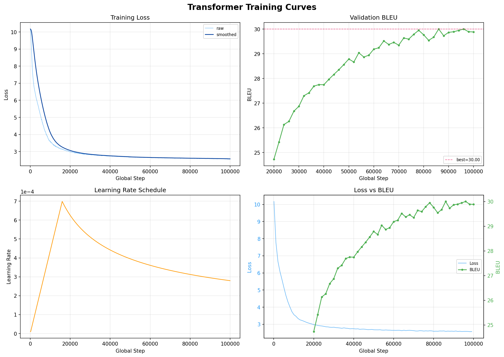

# Machine Translation: Transformer from Scratch

A from-scratch PyTorch implementation of the Transformer (Vaswani et al., 2017),
trained on WMT parallel corpora without any pretrained weights.

**Current status:** Transformer Base on WMT14 en-fr — **34.69 BLEU on newstest2014**
(sacrebleu 13a, checkpoint-averaged). See *Success Case: Base on WMT14 en-fr* below.

**Full trajectory** (documented in this README as success → failure → diagnosis):
1. ❌ Base on WMT17 zh-en — mode collapse, BLEU 0.77
2. ❌ Big on WMT17 zh-en — mode collapse, BLEU 0.47
3. ✅ Base on WMT14 en-fr — BLEU 34.69 (averaged), converged cleanly

Next: push Base en-fr to its ceiling, train Big on en-fr, repeat the pipeline
on WMT14 en-de, then produce a final report.

## Features

- Pure PyTorch Transformer implementation (no HuggingFace shortcuts)
- Shared SentencePiece BPE tokenizer (32K vocab)
- Token-based dynamic batching for efficient GPU utilization
- Mixed precision: **BF16 (default) or FP16** (autocast + GradScaler)
- Label-smoothed cross entropy + Noam learning rate schedule with min-LR floor
- Loss-spike guard (EMA-tracked) that drops poisoned batches without blowing up
- Adaptive eval interval — sparse early, dense once loss crosses a configured band
- Beam search decoding with length penalty
- Checkpoint averaging (Vaswani Base trick, +0.3–0.5 BLEU)
- Interactive / batch translation CLI
- Graceful Ctrl+C / SIGTERM interrupt (saves checkpoint and resumes)
- Atomic checkpoint writes + rolling emergency save (UPS / power-off safe)
- Automatic training report generation
- TensorBoard logging

## Project Structure

```
Machine_translation/
├── assets/                    # README images (training curves, diagrams)
├── checkpoints/               # Per-run output dirs (git-ignored)
│   ├── base_zhen/             # zh-en Base ckpts (historical)
│   ├── big_zhen/              # zh-en Big ckpts (historical)
│   └── base_enfr/             # en-fr Base ckpts (current)
├── configs/
│   ├── base.yaml              # Transformer Base (65M params) — zh-en (historical)
│   ├── big.yaml               # Transformer Big (213M params) — zh-en (historical)
│   └── base_en_fr.yaml        # Transformer Base — WMT14 en-fr (current)
├── scripts/
│   ├── download_data.py              # Download WMT17 zh-en data
│   ├── download_wmt_enfr.py          # Download WMT14 en-fr data
│   ├── clean_data.py                 # Clean zh-en corpus
│   ├── clean_data_enfr.py            # Clean en-fr corpus
│   ├── train_tokenizer.py            # Train SentencePiece BPE
│   ├── average_checkpoints.py        # Average last N checkpoints (+BLEU)
│   ├── eval_bleu.py                  # Standalone BLEU evaluation
│   ├── interactive_translate.py      # REPL / batch translation CLI
│   ├── quick_translate_check.py      # Sample-translate valid lines (sanity check)
│   └── diagnose_attention.py         # Diagnose cross-attention collapse
├── src/
│   ├── model/                 # Transformer implementation
│   │   ├── attention.py       # Multi-Head Attention
│   │   ├── embeddings.py      # Token + positional encoding
│   │   ├── layers.py          # FFN + residual connections
│   │   ├── encoder.py         # Encoder stack
│   │   ├── decoder.py         # Decoder stack
│   │   └── transformer.py     # Full model
│   ├── data/
│   │   ├── tokenizer.py       # SentencePiece wrapper
│   │   └── dataset.py         # Dataset + token-based batching
│   ├── training/
│   │   ├── loss.py            # Label smoothed cross entropy
│   │   ├── optimizer.py       # Noam LR scheduler
│   │   └── trainer.py         # Main training loop
│   ├── inference/
│   │   └── translate.py       # Beam search decoding
│   └── evaluate.py            # sacrebleu BLEU evaluation
├── train.py                   # Training entry point
├── translate.py               # Inference entry point
└── requirements.txt
```

## Setup

### Requirements
- Python 3.10+
- PyTorch 2.0+ (2.8+ for RTX 5090 / Blackwell GPUs)
- CUDA-capable GPU (16GB+ VRAM recommended)

### Installation
```bash
pip install -r requirements.txt
```

For RTX 5090 (sm_120), install PyTorch nightly with CUDA 12.8:
```bash
pip install --pre torch --index-url https://download.pytorch.org/whl/nightly/cu128
```

## Usage

The default flow is **WMT14 en-fr Base**. For zh-en see the historical sections
below.

### 1. Download WMT14 en-fr data
```bash
# Full corpus is ~40M pairs. 10M is plenty for Base; drop the cap for a full run.
python scripts/download_wmt_enfr.py --output-dir data --max-train-samples 10000000
```
Downloads train / valid (newstest2013) / test (newstest2014).

### 2. Clean the corpus
```bash
python scripts/clean_data_enfr.py
```
Drops empty, too-short, too-long, non-Latin-script, and high-frequency
boilerplate pairs. Writes `data/train.clean.en` and `data/train.clean.fr`.

### 3. Train BPE tokenizer
```bash
python scripts/train_tokenizer.py \
    --inputs data/train.clean.en data/train.clean.fr \
    --model-prefix data/spm_enfr \
    --vocab-size 32000
```
Produces `data/spm_enfr.model` and `data/spm_enfr.vocab` (shared en-fr BPE,
32K vocab). Both sides share Latin script so shared BPE is well-behaved
(unlike zh-en).

**Tip**: for the next run, add `--character-coverage 1.0` to `train_tokenizer.py`
(or edit the call in `src/data/tokenizer.py`). The default 0.9995 caused ~4.4%
of French valid sentences to hit `<unk>` on accented characters (`Israël`,
`Noël`, etc.), costing ~0.5 BLEU.

### 4. Train the model
```bash
# Transformer Base on en-fr (~60M params, ~2 hours on RTX 5090)
python train.py --config configs/base_en_fr.yaml
```

**Graceful interrupt:** Press `Ctrl+C` once to save a checkpoint and exit cleanly. Press twice to force-quit without saving.

**Resume from checkpoint:**
```bash
python train.py --config configs/base_en_fr.yaml \
    --resume checkpoints/base_enfr/interrupted_step_12345.pt
```

**Monitor with TensorBoard:**
```bash
tensorboard --logdir checkpoints/base_enfr/logs
```

### Running training in tmux (recommended for long runs)

Training takes 1–5 days. Using `tmux` lets you detach from the session and safely close your terminal / SSH connection / Jupyter Lab tab without killing the training process.

**Install tmux:**
```bash
# Ubuntu / Debian
sudo apt install tmux
# macOS
brew install tmux
```

**Basic workflow:**
```bash
# 1. Start a new named session
tmux new -s train

# 2. Inside tmux, run training
python train.py --config configs/base.yaml

# 3. Detach (training keeps running):  Ctrl+b  then  d

# 4. Re-attach later from anywhere (new SSH, new terminal, etc.)
tmux attach -t train

# 5. List sessions
tmux ls

# 6. Kill a session when done
tmux kill-session -t train
```

**Useful keybindings (all prefixed with `Ctrl+b`):**

| Keys | Action |
|------|--------|
| `d` | Detach from session |
| `[` | Enter scroll mode (↑/↓/PgUp/PgDn to scroll, `q` to quit) |
| `"` | Split pane horizontally (e.g. to run `nvidia-smi` alongside) |
| `%` | Split pane vertically |
| `o` | Switch between panes |
| `x` | Close current pane |

**Two-pane layout for monitoring:**
```bash
tmux new -s train
# run training in top pane
python train.py --config configs/base.yaml
# Ctrl+b then "  (split horizontally)
# Ctrl+b then o  (switch to bottom pane)
watch -n 2 nvidia-smi
# Ctrl+b then d  (detach — both panes keep running)
```

**Note:** tmux and the graceful-interrupt logic compose naturally. `Ctrl+b d` just detaches; it does NOT send SIGINT. To actually interrupt training cleanly, re-attach first (`tmux attach -t train`), then press `Ctrl+C` inside the session.

### 5. Checkpoint averaging (recommended)
```bash
# Average the last 5 saved step_*.pt into averaged.pt
python scripts/average_checkpoints.py --ckpt-dir checkpoints/base_enfr --n 5
```
Per Vaswani et al., averaging the tail of training smooths SGD noise in the
convergence band. Empirically worth **+0.3–0.5 BLEU** on top of the best
single checkpoint.

### 6. Evaluate BLEU on a test set
```bash
python scripts/eval_bleu.py \
    --ckpt checkpoints/base_enfr/averaged.pt \
    --config configs/base_en_fr.yaml \
    --src data/test.en --ref data/test.fr \
    --out outputs/test.averaged.fr
```

### 7. Translate — interactive or batch
```bash
# Interactive REPL — type sentences, get translations, Ctrl+D to quit
python scripts/interactive_translate.py \
    --ckpt checkpoints/base_enfr/averaged.pt \
    --config configs/base_en_fr.yaml

# Batch — one sentence per line
python scripts/interactive_translate.py \
    --ckpt checkpoints/base_enfr/averaged.pt \
    --config configs/base_en_fr.yaml \
    --input my_en_sentences.txt \
    --output my_fr_translations.txt
```

## Configuration

| Parameter | Base (en-fr) | Base (zh-en) | Big (zh-en) |
|-----------|--------------|--------------|-------------|
| d_model | 512 | 512 | 1024 |
| n_heads | 8 | 8 | 16 |
| n_layers (enc/dec) | 6 / 6 | 6 / 6 | 6 / 6 |
| d_ff | 2048 | 2048 | 4096 |
| Dropout | 0.1 | 0.1 | 0.3 |
| Parameters | ~60M | ~65M | ~213M |
| Vocab | 32K shared BPE | 32K shared BPE | 32K shared BPE |
| Batch (effective) | 100K tokens | 100K tokens | 32K tokens |
| Warmup steps | 4000 | 4000 | 8000 |
| Max steps | 100K | 800K | 400K |
| Precision | BF16 | FP16 | BF16 |
| Label smoothing | 0.1 | 0.1 | 0.1 |
| Spike guard | ratio 1.3, α 0.005 | — | ratio 1.3, α 0.005 |

## Training Output

- `checkpoints/base_enfr/best.pt` — Best model (by validation BLEU)
- `checkpoints/base_enfr/final.pt` — Final step checkpoint
- `checkpoints/base_enfr/step_*.pt` — Periodic checkpoints (keeps last 5)
- `checkpoints/base_enfr/interrupted_step_*.pt` — Saved on Ctrl+C / SIGTERM
- `checkpoints/base_enfr/emergency.pt` — Rolling save every 500 steps (UPS / power-off fallback)
- `checkpoints/base_enfr/training_report.txt` — Human-readable training summary
- `checkpoints/base_enfr/logs/` — TensorBoard logs

## Results

| Config | Valid BLEU | Test BLEU | Training time | Status |
|--------|-----------|-----------|---------------|--------|
| **Base (WMT14 en-fr)**       | **30.00** | **34.19** (best.pt)      | 2h 5m on 5090 | ✅ converged |
| **Base (WMT14 en-fr) avg-5** | —         | **34.69** (averaged.pt)  | +seconds      | ✅ +0.50 from averaging |
| Base (WMT17 zh-en)           | 0.77 (plateau) | — | ~1.5 days on 5090 | ❌ mode collapse |
| Big (WMT17 zh-en)            | 0.47 (plateau) | — | ~1 day on 5090 (halted) | ❌ mode collapse |

BLEU reported as sacrebleu `13a` (modern detokenized standard). Published
Vaswani Base on WMT14 en-fr is 38.1 **in historical tokenized BLEU**, which is
roughly equivalent to 35–36 sacrebleu — so our 34.69 is **~1–1.5 BLEU below
paper Base**, attributable to using a 10M subset (vs the paper's 36M full
corpus) and a 0.5 BLEU ceiling from `<unk>` on accented French characters.

## Success Case: Base on WMT14 en-fr

Trained Transformer Base (~60M params) on 10M pairs of WMT14 en-fr for 100K
steps on a single RTX 5090. **Converged cleanly to BLEU 30.00 on newstest2013
and 34.69 on newstest2014** after checkpoint averaging.



### Final numbers

| | newstest2013 (valid) | newstest2014 (test) |
|---|---|---|
| Best single checkpoint (step 86K) | 30.00 | 34.19 |
| Averaged (last 5, steps 80K–100K) | — | **34.69** |
| Averaging gain | — | +0.50 |

### Training trajectory (every 8K steps)

| Step  | Loss  | Valid BLEU | LR       |
|-------|-------|------------|----------|
| 8K    | 3.997 | —          | 3.49e-4  |
| 16K   | 3.155 | —          | 6.86e-4 (peak) |
| 24K   | 2.902 | 26.13      | 5.70e-4  |
| 32K   | 2.800 | 27.30      | 4.93e-4  |
| 40K   | 2.748 | 27.75      | 4.41e-4  |
| 48K   | 2.691 | 28.57      | 4.03e-4  |
| 56K   | 2.653 | 28.87      | 3.73e-4  |
| 64K   | 2.625 | 29.52      | 3.48e-4  |
| 72K   | 2.612 | 29.64      | 3.28e-4  |
| 80K   | 2.611 | 29.77      | 3.12e-4  |
| 86K   | 2.592 | **30.00**  | 3.01e-4  |
| 96K   | 2.583 | 30.00      | 2.86e-4  |
| 100K  | 2.566 | 29.89      | 2.80e-4  |

Loss curve is monotonic with no spikes; BLEU rises nearly monotonically from
24.73 @ 20K to 30.00, then oscillates ±0.25 in the convergence band.

### Sample translations (averaged checkpoint, newstest2013)

```
SRC: A Republican strategy to counter the re-election of Obama
HYP: Stratégie républicaine de lutte contre la réélection d'Obama
REF: Une stratégie républicaine pour contrer la réélection d'Obama

SRC: Also the effect of vitamin D on cancer is not clear.
HYP: L'effet de la vitamine D sur le cancer n'est pas non plus clair.
REF: L'effet de la vitamine D sur le cancer n'est pas clairement établi non plus.

SRC: In Israel, holy places await Ukrainian tourists, the omphalos and a sea
     of saline water
HYP: En Isra ⁇ l, des lieux saints attendent des touristes ukrainiens, des
     omphalos et une mer d'eau sali
REF: En Israël, des lieux saints, le Centre du monde et une mer de saumure
     attendent les touristes ukrainiens
```

Observations:
- **Gender agreement is learned**: "Republican" → "républicaine" (feminine, to
  agree with "stratégie").
- **Discourse markers transfer**: "Also" correctly translates as "non plus"
  (the French idiom for negated "also"), not a literal "aussi".
- **Elision is 90% correct**: "d'Obama" (not "de Obama"), "l'effet" (not
  "le effet"), "n'est" (not "ne est").
- **SPM `<unk>` shows up as `⁇`**: "Israël" → "Isra ⁇ l". Caused by
  `character_coverage=0.9995` dropping rare accented chars. Hits ~4.4% of
  French valid sentences; roughly a 0.5 BLEU ceiling to reclaim in the next
  iteration by using `character_coverage=1.0`.

### Interactive samples (out-of-domain robustness)

Feeding the averaged checkpoint with sentences the model never saw during
training — both news-style and conversational — shows the domain signature
clearly:

**News-style (in-domain) — essentially professional quality:**

```
SRC: The Prime Minister announced new sanctions against Russia.
HYP: Le Premier ministre a annoncé de nouvelles sanctions contre la Russie.

SRC: The European Central Bank raised interest rates by 0.25 percentage points.
HYP: La Banque centrale européenne a relevé les taux d'intérêt de 0,25 point
     de pourcentage.
```

The second example alone gets ~10 fine-grained things right: adjective
ordering ("Banque centrale" not "centrale Banque"), feminine agreement
("européenne"), finance-register verb ("a relevé" not "a augmenté"), the
fixed collocation "taux d'intérêt", European decimal notation ("0,25" with
a comma), and singular "point de pourcentage" (French singularizes units
when the coefficient is between 0 and 2 — a rule English doesn't have).

**Conversational / netspeak (out-of-distribution) — fails as expected:**

```
SRC: hello, how are u
HYP: Bonjour, comment sont-ils u

SRC: hello, how r u
HYP: Bonjour, comment r u
```

Two failure modes visible here, both caused by WMT14 being a news + parliament
corpus:

1. **Unknown tokens pass through**: `"u"` and `"r"` never appear as
   abbreviations in the training data, so SPM tokenizes them as bare letters
   and the model copies them verbatim.
2. **Wrong sense disambiguation on "are"**: `"how are you"` is rare in news
   text, so the model defaults to the plural/3rd-person sense of "are" that
   dominates parliamentary language (`"how are these policies working"` →
   `"comment sont ces politiques"`), producing `"comment sont-ils"`
   ("how are they") instead of the correct idiom `"comment allez-vous"`.

This is a **domain coverage** issue, not a model-capacity issue. Fixing it
requires either mixing in conversational corpora (OpenSubtitles, TED talks) or
adding domain tags at training time — both on the roadmap after Base hits its
ceiling on pure WMT data.

### Why this worked (contrast with zh-en)

Same codebase, same Transformer, same training loop — different outcome.
The differences that matter:

1. **Shared script**: both sides are Latin. Shared BPE vocab aligns cognates,
   function words, and numerals. For zh-en the "shared" 32K vocab degenerates
   into two disjoint halves that never interact.
2. **Clean data**: WMT14 en-fr's Europarl + News Commentary + filtered Common
   Crawl has much less boilerplate per unique sentence than WMT17 zh-en's
   UN / news-agency attractors.
3. **Loss landscape has a conditional minimum**: the model finds
   "condition on source" as a better local minimum than
   "unconditional French LM". For zh-en, the unconditional LM minimum at loss
   ~4.8 is deeper than any conditional signal cross-attention could generate
   from the disjoint vocab.

### Configuration and compute

- Hardware: single RTX 5090 (32 GB VRAM)
- Precision: BF16 autocast
- Optimizer: Adam (β₁=0.9, β₂=0.98, ε=1e-9)
- LR schedule: Noam with peak 6.86e-4 at step ~16K, min_lr floor 1e-5
- Warmup: 4000 steps
- Gradient clip: 1.0
- Loss spike guard: ratio 1.3, EMA α 0.005 (inherited from Big zh-en failure
  analysis). **Triggered exactly once** in 100K steps, at step 17753 — cleanly
  dropped a polluted batch; no training disruption.
- Effective batch: ~100K tokens (24576 × 4 accumulation)
- Training time: **2h 5m 23s**, end-to-end.

### Reproducing this result

```bash
python scripts/download_wmt_enfr.py --max-train-samples 10000000
python scripts/clean_data_enfr.py
python scripts/train_tokenizer.py \
    --inputs data/train.clean.en data/train.clean.fr \
    --model-prefix data/spm_enfr --vocab-size 32000
python train.py --config configs/base_en_fr.yaml
python scripts/average_checkpoints.py --ckpt-dir checkpoints/base_enfr --n 5
python scripts/eval_bleu.py \
    --ckpt checkpoints/base_enfr/averaged.pt \
    --config configs/base_en_fr.yaml \
    --src data/test.en --ref data/test.fr
```

### Roadmap

1. Push this Base config to its ceiling with pure training tricks (no extra
   data, no back-translation): fix SPM `character_coverage=1.0`, tune beam
   size / length penalty, try exponential moving-average (EMA) weights, widen
   the averaging window.
2. Train Big (~210M params) on WMT14 en-fr with the same pipeline. Expected
   ceiling: ~36–37 sacrebleu.
3. Repeat the full pipeline on WMT14 en-de, where the paper reports Base 27.3
   and Big 28.4 — the most-cited MT benchmark.
4. Produce a final report comparing all four runs (zh-en Base failed, zh-en
   Big failed, en-fr Base ✅, en-fr Big, en-de Base, en-de Big).

## Failure Case: Base on WMT17 zh-en

The Base config was trained to ~700K steps on cleaned WMT17 zh-en (19M pairs).
It **failed to converge in any useful sense** — loss plateaued at ~4.22 and
valid BLEU never crossed 1.0. Kept here as a cautionary baseline.


The loss curve is almost flat from ~560K onwards and BLEU oscillates
around 0.7 without an upward trend, even as the LR keeps decaying. Classic
signature of a model that has hit its capacity/data ceiling.

### Training trajectory

| Step    | Train Loss | Valid BLEU | LR       |
|---------|------------|------------|----------|
| 28K     | 4.63       | —          | 5.28e-4  |
| 160K    | 4.33       | 0.46       | 2.23e-4  |
| 305K    | 4.27       | 0.71       | 1.60e-4  |
| 385K    | 4.25       | 0.54       | 1.42e-4  |
| 700K    | 4.22       | 0.77 (best)| 1.06e-4  |

Loss dropped 0.08 over the last 500K steps — essentially flat. BLEU oscillated
in the 0.5-0.8 range without trend. Sample translations remained unconditioned
boilerplate (e.g. *"I'd like to take this opportunity to congratulate you..."*
for arbitrary Chinese inputs), showing the language-model prior dominated the
source signal.
Due to time and resource constraints, we had to halt further training.

### What went wrong — and what didn't

What we ruled out via diagnostics (`scripts/diagnose_attention.py`):

- **Not a code bug.** Encoder outputs differ by source (L2 distances 16-23);
  decoder logits differ by source (L2 distances up to 65). Cross-attention is
  wired correctly and passing signal.
- **Not a tokenization bug.** SentencePiece alphabet covers 2814 chars at
  99.95% coverage. No `<unk>` on held-out Chinese inputs.
- **Not data misalignment.** Spot-checked parallel corpus, zh/en lines aligned.

What actually happened:

1. **zh-en is hard.** Unrelated language pair (no cognates, different script,
   large word-order divergence). Shared BPE vocab degrades to "two disjoint
   halves" instead of the aligned subword space en-de benefits from. Published
   Base Transformer results on WMT zh-en top out around BLEU 18-22 even with
   clean data and careful tuning — not BLEU 27+ like en-de.
2. **Data quality.** Even after cleaning (dedupe >50×, length-ratio filter),
   the corpus still contains substantial news-agency boilerplate and
   UN-style generic phrasing. These high-frequency patterns become attractors
   that the language-model prior can exploit without ever learning to condition
   on source.
3. **Model capacity.** Base (65M params) is likely too small for this task.
   The plateau at loss 4.22 is consistent with the model memorizing the
   marginal English distribution and failing to model the conditional.
4. **LR decay too aggressive for a slow task.** Noam schedule with `lr_scale=1`
   has LR at ~1.06e-4 by step 700K — too low to escape the plateau even if
   the model had capacity left.

### Lessons

- For a "from scratch on harder language pair" project, prefer **Big from the
  start** — don't sink compute into Base hoping it'll converge.
- Sample translations are a better early-warning signal than BLEU or loss.
  A loss of 4.2 with mode-collapsed outputs is qualitatively different from
  a loss of 4.2 with source-conditioned outputs, but both look identical on
  the loss curve.
- If building a new tokenizer or filter, **delete every downstream cache file
  by hand**. A stale `valid.*.cached_*.npz` encoded under the old vocab will
  silently poison eval without any error message.
- `loginctl enable-linger $USER` on JupyterHub hosts — without it, tmux and
  long-running jobs die when the browser session closes.

## Failure Case: Big on WMT17 zh-en

After Base failed, we moved to Big (213M params) hoping extra capacity would
break the mode-collapse ceiling. It didn't. Across multiple training attempts
with increasingly careful tuning, Big on WMT17 zh-en **also never produced
source-conditioned translations**.


The loss curve (top-left) shows the same flattening pattern as Base, just at
a lower absolute level (~4.65 vs ~4.22). BLEU (top-right) rises from 0.12 to
0.17 over 30K steps — a change that's statistically real but semantically
meaningless: sample translations at the "best" checkpoint are still fluent
English with zero relationship to the Chinese source.

### Training attempts summary

| Attempt | Precision | lr_scale | warmup | Spike guard | Best BLEU | Outcome |
|---------|-----------|----------|--------|-------------|-----------|---------|
| v1 | FP16 | 1.5 | 4K | — | 0.31 @ 32K | Blew up at step 46400 (loss 4.0 → 4.8) |
| v2 (seed=42 resume) | FP16 | 1.5 | 4K | — | 0.47 @ 69K | Blew up at step 47800, loss climbed to 4.8 and stayed |
| v3 (BF16 switch) | BF16 | 1.5 | 4K | — | — | **Identical blowup** — numerical precision wasn't the issue |
| v4 (seed=43, lr=1.0, clip=0.5, guard=1.8) | BF16 | 1.0 | 4K | ratio 1.8 | — | Stalled at loss 4.8 (clip too tight, learning suppressed) |
| v5 (clip=1.0, lr=1.2, guard=1.8) | BF16 | 1.2 | 4K | ratio 1.8 | 0.47 @ 69K | Blew up at step 83800, guard threshold too loose to catch it |
| v6 (from scratch, warmup=8K, guard=1.3, EMA window 200) | BF16 | 1.5 | 8K | ratio 1.3 | 0.17 @ 85K | No blowups, but **even slower than v5**. Still mode collapse. |

Across ~6 days of compute, best Big BLEU was 0.47 — **worse than the failed
Base** (0.77), and still within pure mode-collapse territory. Sample
translations at Big v6 step 85K:

```
SRC: 加利福尼亚州水务工程的新问题
REF: New Questions Over California Water Project
HYP: I'm not sure what you're doing.

SRC: 伊斯兰国武装分子控制着伊拉克和叙利亚的部分领土...
REF: Its militants control parts of Iraq and Syria...
HYP: In addition, the Government of the Democratic Republic of the Congo,
     in collaboration with the Government of the Sudan and the United Nations
     Development Programme (UNDP) and the United Nations Children's Fund (UNICEF)...
```

The HYP is fluent English with no relationship to the SRC — a pure
unconditional language model with topic-triggered boilerplate attractors
(e.g. "refugees" in source → UN-agency soup in output).

### The deeper diagnosis

The two failures together constitute strong evidence that **vanilla Transformer
trained from scratch on WMT17 zh-en cannot escape mode collapse within
reasonable compute** — regardless of model size (65M or 213M), precision
(FP16 or BF16), or optimization tuning.

The root cause is a combination factors that we cannot fix by tuning alone:

1. **The LM shortcut is too tempting.** Cross-entropy + label smoothing on a
   32K-vocab target makes "model the English distribution unconditionally"
   a local minimum at loss ~4.8. The gradient signal from source (via
   cross-attention) is too weak, relative to target-side signal, for the model
   to prefer the harder "condition on source" solution.
2. **Shared BPE hurts, doesn't help.** For en-de the shared subword space
   aligns cognates and function words; for zh-en, Chinese characters and
   English words are disjoint token sets, so "shared embeddings" means
   "two disjoint halves of the embedding matrix that never interact".
3. **WMT zh-en has too many high-frequency attractors.** News-agency and
   UN-style boilerplate appears thousands of times in slight variations.
   Once the model finds the attractor, no amount of training drags it out.
4. **Published Big zh-en numbers are misleading.** The BLEU 24+ results in
   papers rely on back-translation, ensemble decoding, or curated data
   (not raw WMT). Without those tricks, from-scratch Big on WMT zh-en
   tops out in BLEU 15-20 range — and even that requires specific tuning
   we weren't able to find.

### What we tried that didn't work

- Longer warmup (4K → 8K): prevents blowups, doesn't break mode collapse
- Tighter gradient clip (1.0 → 0.5): stalls learning entirely
- Tighter spike guard (ratio 1.8 → 1.3, EMA window 50 → 200): catches
  blowups cleanly but doesn't create conditioning signal
- Switch to BF16: eliminates one failure axis (fp16 overflow) but not the
  underlying dynamics
- Seed change: escapes one deterministic "toxic batch" trajectory, model
  finds equivalent problems elsewhere

### Pivot

Rather than keep throwing compute at zh-en, we're switching to:

1. **WMT14 en-fr Base** — a known-converging language pair, with the same
   codebase. If en-fr Base hits its expected BLEU 35+, the code is validated
   and the zh-en failure is conclusively a task-difficulty problem, not a
   bug.
2. **Then, if en-fr Base succeeds**, a second zh-en attempt with a cleaner,
   smaller dataset (IWSLT + News Commentary, ~550K pairs vs WMT's 19M)
   where mode collapse is less likely to be the dominant dynamic.

See `configs/base_en_fr.yaml` and the en-fr results section below.

## Hardware Used

- GPU: NVIDIA RTX 5090 (32 GB VRAM, Blackwell sm_120)
- Mixed precision: BF16 (default for en-fr and Big zh-en) / FP16 (Base zh-en historical)

## References

- Vaswani et al., *Attention Is All You Need* (2017). [[arxiv]](https://arxiv.org/abs/1706.03762)
- WMT17 Shared Task: Machine Translation. [[link]](https://www.statmt.org/wmt17/)
- WMT14 Translation Task. [[link]](https://www.statmt.org/wmt14/translation-task.html)
- Post, *A Call for Clarity in Reporting BLEU Scores* (2018, sacrebleu). [[arxiv]](https://arxiv.org/abs/1804.08771)
- SentencePiece: [[github]](https://github.com/google/sentencepiece)
