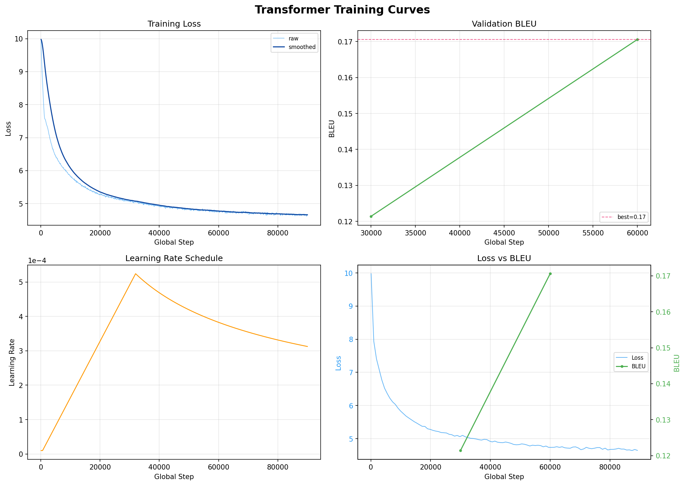

# Machine Translation: Transformer from Scratch

A from-scratch PyTorch implementation of the Transformer model (Vaswani et al., 2017) for Chinese-English machine translation, trained on WMT17 parallel corpus.

**Goal:** Reach BLEU 25+ on WMT test sets without using pretrained models.

## Features

- Pure PyTorch Transformer implementation (no HuggingFace shortcuts)
- Shared SentencePiece BPE tokenizer (32K vocab)
- Token-based dynamic batching for efficient GPU utilization
- Mixed precision training (FP16)
- Label-smoothed cross entropy + Noam learning rate schedule
- Beam search decoding with length penalty
- Graceful Ctrl+C / SIGTERM interrupt (saves checkpoint and resumes)
- Atomic checkpoint writes + rolling emergency save (UPS / power-off safe)
- Automatic training report generation
- TensorBoard logging

## Project Structure

```
Machine_translation/
├── configs/
│   ├── base.yaml              # Transformer Base (65M params)
│   └── big.yaml               # Transformer Big (213M params)
├── scripts/
│   ├── download_data.py       # Download WMT17 zh-en data
│   └── train_tokenizer.py     # Train SentencePiece BPE
├── src/
│   ├── model/                 # Transformer implementation
│   │   ├── attention.py       # Multi-Head Attention
│   │   ├── embeddings.py      # Token + positional encoding
│   │   ├── layers.py          # FFN + residual connections
│   │   ├── encoder.py         # Encoder stack
│   │   ├── decoder.py         # Decoder stack
│   │   └── transformer.py     # Full model
│   ├── data/
│   │   ├── tokenizer.py       # SentencePiece wrapper
│   │   └── dataset.py         # Dataset + token-based batching
│   ├── training/
│   │   ├── loss.py            # Label smoothed cross entropy
│   │   ├── optimizer.py       # Noam LR scheduler
│   │   └── trainer.py         # Main training loop
│   ├── inference/
│   │   └── translate.py       # Beam search decoding
│   └── evaluate.py            # sacrebleu BLEU evaluation
├── train.py                   # Training entry point
├── translate.py               # Inference entry point
└── requirements.txt
```

## Setup

### Requirements
- Python 3.10+
- PyTorch 2.0+ (2.8+ for RTX 5090 / Blackwell GPUs)
- CUDA-capable GPU (16GB+ VRAM recommended)

### Installation
```bash
pip install -r requirements.txt
```

For RTX 5090 (sm_120), install PyTorch nightly with CUDA 12.8:
```bash
pip install --pre torch --index-url https://download.pytorch.org/whl/nightly/cu128
```

## Usage

### 1. Download WMT17 zh-en data
```bash
python scripts/download_data.py --output-dir data
```
Downloads ~25M sentence pairs (train / valid / test splits).

### 2. Train BPE tokenizer
```bash
python scripts/train_tokenizer.py \
    --inputs data/train.zh data/train.en \
    --model-prefix data/spm \
    --vocab-size 32000
```
Produces `data/spm.model` and `data/spm.vocab` (shared zh-en BPE, 32K vocab).

### 3. Train the model
```bash
# Transformer Base (~65M params, 1.5-2.5 days on RTX 5090)
python train.py --config configs/base.yaml

# Transformer Big (~213M params, 3-5 days on RTX 5090)
python train.py --config configs/big.yaml
```

**Graceful interrupt:** Press `Ctrl+C` once to save a checkpoint and exit cleanly. Press twice to force-quit without saving.

**Resume from checkpoint:**
```bash
python train.py --config configs/base.yaml --resume checkpoints/interrupted_step_12345.pt
```

**Monitor with TensorBoard:**
```bash
tensorboard --logdir checkpoints/logs
```

### Running training in tmux (recommended for long runs)

Training takes 1–5 days. Using `tmux` lets you detach from the session and safely close your terminal / SSH connection / Jupyter Lab tab without killing the training process.

**Install tmux:**
```bash
# Ubuntu / Debian
sudo apt install tmux
# macOS
brew install tmux
```

**Basic workflow:**
```bash
# 1. Start a new named session
tmux new -s train

# 2. Inside tmux, run training
python train.py --config configs/base.yaml

# 3. Detach (training keeps running):  Ctrl+b  then  d

# 4. Re-attach later from anywhere (new SSH, new terminal, etc.)
tmux attach -t train

# 5. List sessions
tmux ls

# 6. Kill a session when done
tmux kill-session -t train
```

**Useful keybindings (all prefixed with `Ctrl+b`):**

| Keys | Action |
|------|--------|
| `d` | Detach from session |
| `[` | Enter scroll mode (↑/↓/PgUp/PgDn to scroll, `q` to quit) |
| `"` | Split pane horizontally (e.g. to run `nvidia-smi` alongside) |
| `%` | Split pane vertically |
| `o` | Switch between panes |
| `x` | Close current pane |

**Two-pane layout for monitoring:**
```bash
tmux new -s train
# run training in top pane
python train.py --config configs/base.yaml
# Ctrl+b then "  (split horizontally)
# Ctrl+b then o  (switch to bottom pane)
watch -n 2 nvidia-smi
# Ctrl+b then d  (detach — both panes keep running)
```

**Note:** tmux and the graceful-interrupt logic compose naturally. `Ctrl+b d` just detaches; it does NOT send SIGINT. To actually interrupt training cleanly, re-attach first (`tmux attach -t train`), then press `Ctrl+C` inside the session.

### 4. Translate
```bash
# From a file
python translate.py --checkpoint checkpoints/best.pt --input test_input.txt

# From stdin
python translate.py --checkpoint checkpoints/best.pt
```

## Configuration

| Parameter | Base | Big |
|-----------|------|-----|
| d_model | 512 | 1024 |
| n_heads | 8 | 16 |
| n_layers (enc/dec) | 6 / 6 | 6 / 6 |
| d_ff | 2048 | 4096 |
| Dropout | 0.1 | 0.3 |
| Parameters | ~65M | ~213M |
| Vocab | 32K (shared BPE) | 32K (shared BPE) |
| Batch | 32K tokens | 32K tokens |
| Warmup steps | 4000 | 4000 |
| Max steps | 300K | 300K |
| Label smoothing | 0.1 | 0.1 |

## Training Output

- `checkpoints/best.pt` — Best model (by validation BLEU)
- `checkpoints/final.pt` — Final step checkpoint
- `checkpoints/step_*.pt` — Periodic checkpoints (keeps last 5)
- `checkpoints/interrupted_step_*.pt` — Saved on Ctrl+C / SIGTERM
- `checkpoints/emergency.pt` — Rolling save every 500 steps (UPS / power-off fallback)
- `checkpoints/training_report.txt` — Human-readable training summary
- `checkpoints/logs/` — TensorBoard logs

## Results

| Config | Valid BLEU | Test BLEU | Training time |
|--------|-----------|-----------|---------------|
| Base (WMT17 zh-en) | 0.77 (plateau) | — | ~1.5 days on 5090 |
| Big (WMT17 zh-en)  | 0.47 (plateau) | — | ~1 day on 5090 (halted) |

Both WMT17 zh-en runs failed to produce source-conditioned translations.
The project is pivoting to **WMT en-fr Base** as a pipeline validation
(Section *Pivot* below).

## Failure Case: Base on WMT17 zh-en

The Base config was trained to ~700K steps on cleaned WMT17 zh-en (19M pairs).
It **failed to converge in any useful sense** — loss plateaued at ~4.22 and
valid BLEU never crossed 1.0. Kept here as a cautionary baseline.


The loss curve is almost flat from ~560K onwards and BLEU oscillates
around 0.7 without an upward trend, even as the LR keeps decaying. Classic
signature of a model that has hit its capacity/data ceiling.

### Training trajectory

| Step    | Train Loss | Valid BLEU | LR       |
|---------|------------|------------|----------|
| 28K     | 4.63       | —          | 5.28e-4  |
| 160K    | 4.33       | 0.46       | 2.23e-4  |
| 305K    | 4.27       | 0.71       | 1.60e-4  |
| 385K    | 4.25       | 0.54       | 1.42e-4  |
| 700K    | 4.22       | 0.77 (best)| 1.06e-4  |

Loss dropped 0.08 over the last 500K steps — essentially flat. BLEU oscillated
in the 0.5-0.8 range without trend. Sample translations remained unconditioned
boilerplate (e.g. *"I'd like to take this opportunity to congratulate you..."*
for arbitrary Chinese inputs), showing the language-model prior dominated the
source signal.
Due to time and resource constraints, we had to halt further training.

### What went wrong — and what didn't

What we ruled out via diagnostics (`scripts/diagnose_attention.py`):

- **Not a code bug.** Encoder outputs differ by source (L2 distances 16-23);
  decoder logits differ by source (L2 distances up to 65). Cross-attention is
  wired correctly and passing signal.
- **Not a tokenization bug.** SentencePiece alphabet covers 2814 chars at
  99.95% coverage. No `<unk>` on held-out Chinese inputs.
- **Not data misalignment.** Spot-checked parallel corpus, zh/en lines aligned.

What actually happened:

1. **zh-en is hard.** Unrelated language pair (no cognates, different script,
   large word-order divergence). Shared BPE vocab degrades to "two disjoint
   halves" instead of the aligned subword space en-de benefits from. Published
   Base Transformer results on WMT zh-en top out around BLEU 18-22 even with
   clean data and careful tuning — not BLEU 27+ like en-de.
2. **Data quality.** Even after cleaning (dedupe >50×, length-ratio filter),
   the corpus still contains substantial news-agency boilerplate and
   UN-style generic phrasing. These high-frequency patterns become attractors
   that the language-model prior can exploit without ever learning to condition
   on source.
3. **Model capacity.** Base (65M params) is likely too small for this task.
   The plateau at loss 4.22 is consistent with the model memorizing the
   marginal English distribution and failing to model the conditional.
4. **LR decay too aggressive for a slow task.** Noam schedule with `lr_scale=1`
   has LR at ~1.06e-4 by step 700K — too low to escape the plateau even if
   the model had capacity left.

### Lessons

- For a "from scratch on harder language pair" project, prefer **Big from the
  start** — don't sink compute into Base hoping it'll converge.
- Sample translations are a better early-warning signal than BLEU or loss.
  A loss of 4.2 with mode-collapsed outputs is qualitatively different from
  a loss of 4.2 with source-conditioned outputs, but both look identical on
  the loss curve.
- If building a new tokenizer or filter, **delete every downstream cache file
  by hand**. A stale `valid.*.cached_*.npz` encoded under the old vocab will
  silently poison eval without any error message.
- `loginctl enable-linger $USER` on JupyterHub hosts — without it, tmux and
  long-running jobs die when the browser session closes.

## Failure Case: Big on WMT17 zh-en

After Base failed, we moved to Big (213M params) hoping extra capacity would
break the mode-collapse ceiling. It didn't. Across multiple training attempts
with increasingly careful tuning, Big on WMT17 zh-en **also never produced
source-conditioned translations**.



The loss curve (top-left) shows the same flattening pattern as Base, just at
a lower absolute level (~4.65 vs ~4.22). BLEU (top-right) rises from 0.12 to
0.17 over 30K steps — a change that's statistically real but semantically
meaningless: sample translations at the "best" checkpoint are still fluent
English with zero relationship to the Chinese source.

### Training attempts summary

| Attempt | Precision | lr_scale | warmup | Spike guard | Best BLEU | Outcome |
|---------|-----------|----------|--------|-------------|-----------|---------|
| v1 | FP16 | 1.5 | 4K | — | 0.31 @ 32K | Blew up at step 46400 (loss 4.0 → 4.8) |
| v2 (seed=42 resume) | FP16 | 1.5 | 4K | — | 0.47 @ 69K | Blew up at step 47800, loss climbed to 4.8 and stayed |
| v3 (BF16 switch) | BF16 | 1.5 | 4K | — | — | **Identical blowup** — numerical precision wasn't the issue |
| v4 (seed=43, lr=1.0, clip=0.5, guard=1.8) | BF16 | 1.0 | 4K | ratio 1.8 | — | Stalled at loss 4.8 (clip too tight, learning suppressed) |
| v5 (clip=1.0, lr=1.2, guard=1.8) | BF16 | 1.2 | 4K | ratio 1.8 | 0.47 @ 69K | Blew up at step 83800, guard threshold too loose to catch it |
| v6 (from scratch, warmup=8K, guard=1.3, EMA window 200) | BF16 | 1.5 | 8K | ratio 1.3 | 0.17 @ 85K | No blowups, but **even slower than v5**. Still mode collapse. |

Across ~6 days of compute, best Big BLEU was 0.47 — **worse than the failed
Base** (0.77), and still within pure mode-collapse territory. Sample
translations at Big v6 step 85K:

```
SRC: 加利福尼亚州水务工程的新问题
REF: New Questions Over California Water Project
HYP: I'm not sure what you're doing.

SRC: 伊斯兰国武装分子控制着伊拉克和叙利亚的部分领土...
REF: Its militants control parts of Iraq and Syria...
HYP: In addition, the Government of the Democratic Republic of the Congo,
     in collaboration with the Government of the Sudan and the United Nations
     Development Programme (UNDP) and the United Nations Children's Fund (UNICEF)...
```

The HYP is fluent English with no relationship to the SRC — a pure
unconditional language model with topic-triggered boilerplate attractors
(e.g. "refugees" in source → UN-agency soup in output).

### The deeper diagnosis

The two failures together constitute strong evidence that **vanilla Transformer
trained from scratch on WMT17 zh-en cannot escape mode collapse within
reasonable compute** — regardless of model size (65M or 213M), precision
(FP16 or BF16), or optimization tuning.

The root cause is a combination factors that we cannot fix by tuning alone:

1. **The LM shortcut is too tempting.** Cross-entropy + label smoothing on a
   32K-vocab target makes "model the English distribution unconditionally"
   a local minimum at loss ~4.8. The gradient signal from source (via
   cross-attention) is too weak, relative to target-side signal, for the model
   to prefer the harder "condition on source" solution.
2. **Shared BPE hurts, doesn't help.** For en-de the shared subword space
   aligns cognates and function words; for zh-en, Chinese characters and
   English words are disjoint token sets, so "shared embeddings" means
   "two disjoint halves of the embedding matrix that never interact".
3. **WMT zh-en has too many high-frequency attractors.** News-agency and
   UN-style boilerplate appears thousands of times in slight variations.
   Once the model finds the attractor, no amount of training drags it out.
4. **Published Big zh-en numbers are misleading.** The BLEU 24+ results in
   papers rely on back-translation, ensemble decoding, or curated data
   (not raw WMT). Without those tricks, from-scratch Big on WMT zh-en
   tops out in BLEU 15-20 range — and even that requires specific tuning
   we weren't able to find.

### What we tried that didn't work

- Longer warmup (4K → 8K): prevents blowups, doesn't break mode collapse
- Tighter gradient clip (1.0 → 0.5): stalls learning entirely
- Tighter spike guard (ratio 1.8 → 1.3, EMA window 50 → 200): catches
  blowups cleanly but doesn't create conditioning signal
- Switch to BF16: eliminates one failure axis (fp16 overflow) but not the
  underlying dynamics
- Seed change: escapes one deterministic "toxic batch" trajectory, model
  finds equivalent problems elsewhere

### Pivot

Rather than keep throwing compute at zh-en, we're switching to:

1. **WMT14 en-fr Base** — a known-converging language pair, with the same
   codebase. If en-fr Base hits its expected BLEU 35+, the code is validated
   and the zh-en failure is conclusively a task-difficulty problem, not a
   bug.
2. **Then, if en-fr Base succeeds**, a second zh-en attempt with a cleaner,
   smaller dataset (IWSLT + News Commentary, ~550K pairs vs WMT's 19M)
   where mode collapse is less likely to be the dominant dynamic.

See `configs/base_en_fr.yaml` and the en-fr results section below.

## Hardware Used

- GPU: NVIDIA RTX 5090 (32GB VRAM)
- Mixed precision: FP16

## References

- Vaswani et al., *Attention Is All You Need* (2017). [[arxiv]](https://arxiv.org/abs/1706.03762)
- WMT17 Shared Task: Machine Translation. [[link]](https://www.statmt.org/wmt17/)
- SentencePiece: [[github]](https://github.com/google/sentencepiece)
